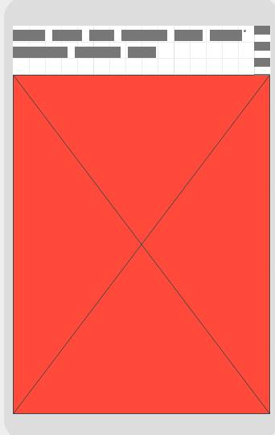
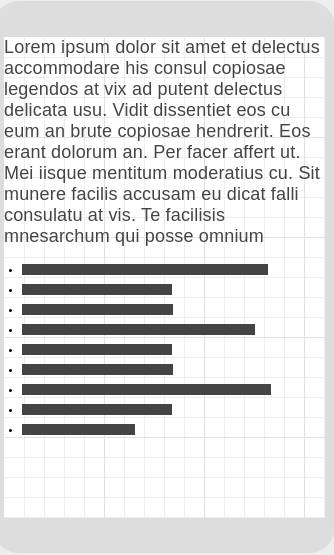
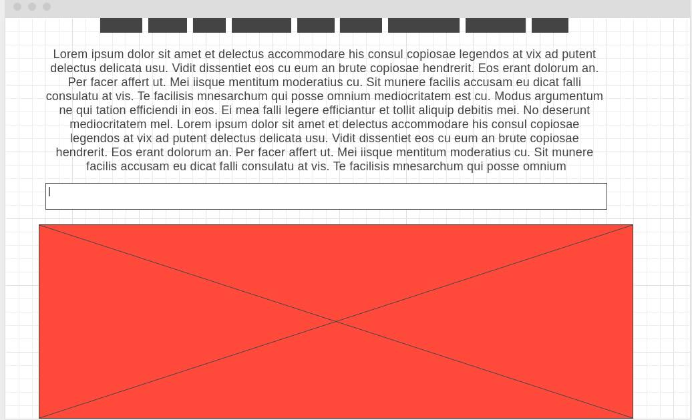
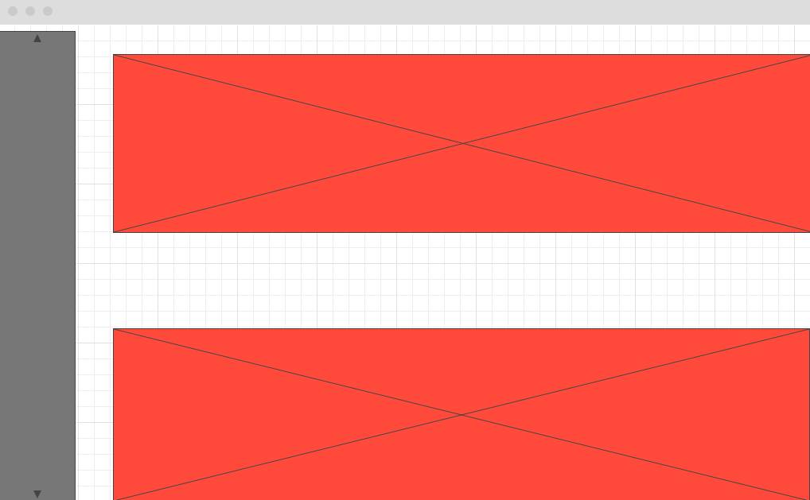
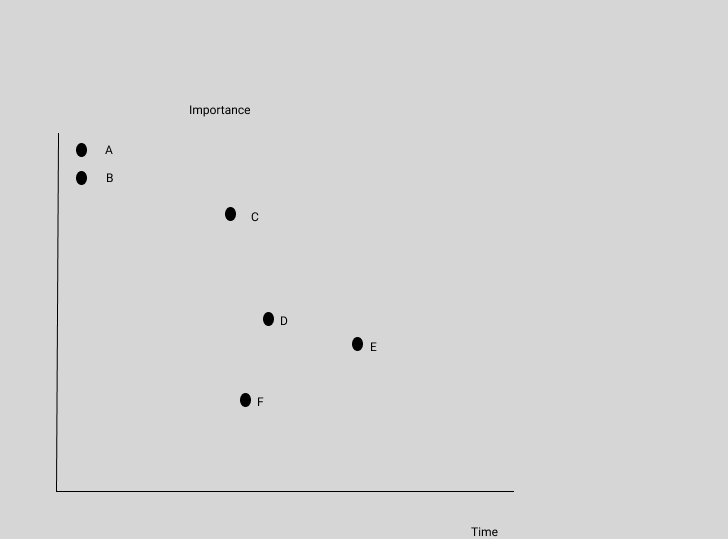

# Stack Survey

## A simple app for Stack Overflow language trends

## Project Schedule

| Day      | Deliverable                                      | Status     |
| -------- | ------------------------------------------------ | ---------- |
| Sep 10th | Project Description/ Priority Matrix/ Wireframes | Complete   |
| Sep 11th | Functional Components/ Base CSS/HTML             | Complete   |
| Sep 12th | Core JavaScript functionality                    | Complete   |
| Sep 13th | C3.js Graphing implementation                    | Comeplete  |
| Sep 14th | Responsiveness via CSS                           | Incomplete |
| Sep 15th | MVP                                              | Incomplete |
| Sep 16th | Present                                          | Incomplete |

## Wireframes

### Mobile Wireframes:

### Desktop Wireframes

### Priorities

- A: Grab API Key
- B: Successfully grab JSON and store into reusable data structures
- C: Finish scaffolding HTML/CSS and base Javascript components
- D: Add responsiveness for mobile
- F: Display data using interactive C3.js graphs

For this project I'll be using the Stackexchange API to grab Stackoverflow language queries and display monthly to yearly language trends over to the user.

Here's an example of the data I'll be using:

## API Data

### MVP

- Grab external data from StackExchange API
- Render Language queries from StackExchange API
- Allow users to enter different search queries to interact with the data on the page
- Mobile responsiveness

### Post-MVP

- Display data through C3.js Charts
- Allow users to filter their data using different dates
- Display language comparisons
- Add animations for chart rendering

## Time Frames

| Component                      | Priority | Estimated Time | Time Invested | Actual Time |
| ------------------------------ | :------: | :------------: | :-----------: | :---------: |
| Wireframing                    |    H     |      4hrs      |     4hrs      |     4hrs    |
| Scaffolding for HTML/CSS/C3.JS |    H     |      3hrs      |     3hrs      |     3hrs    |
| Render Language queries to page|    H     |      2hrs      |     2.5hrs    |     2.5hrs  |
| Apply search event listeners   |    H     |      4hrs      |     4Hrs      |     4hrs    |
| C3.JS interact with listeners  |    H     |      5hrs      |     3hrs      |      3hrs   |
| Add responsiveness             |    H     |      8hrs      |               |             |
| Add filtering with time  input |    M     |      2hrs      |               |             |
| Add  lang vs lang section      |    M     |      2hrs      |               |             |

| Total                          |    H     |     30hrs     |               |             |

## Code Snippet

## Change Log
