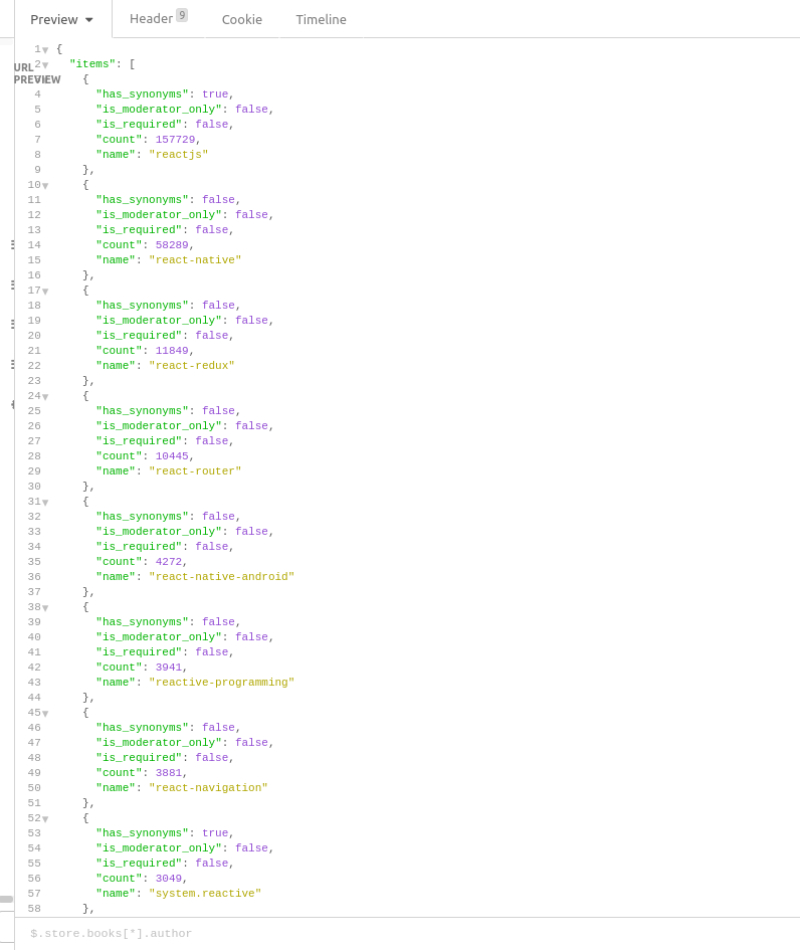

# Stack Survey

## A simple app for Stack Overflow language trends

## Project Schedule

|  Day | Deliverable | Status
|---|---| ---|
|Sep 10th| Project Description/ Priority Matrix/ Wireframes | Incomplete
|Sep 11th|Functional Components/ Base CSS/HTML | Incomplete
|Sep 12th| Core JavaScript functionality | Incomplete
|Sep 13th| C3.js Graphing implementation | Incomplete
|Sep 14th| Responsiveness via CSS | Incomplete
|Sep 15th| MVP | Incomplete
|Sep 16th| Present | Incomplete

## Wireframes

### Priorities

* A: Grab API Key
* B: Successfully grab JSON and store into reusable data structures
* C: Finish scaffolding HTML/CSS and base Javascript components
* D: Add responsiveness for mobile
* F: Display data using interactive C3.js graphs

For this project I'll be using the Stackexchange API to grab Stackoverflow language queries and display monthly to yearly language trends over to the user.

Here's an example of the data I'll be using:
## API Data

In order to implement these features I'll need :

1. To query multiple different languages through the API
2. Add hook in query filters to the browser to allow the user to modify their searches
3. Connect search data from 
